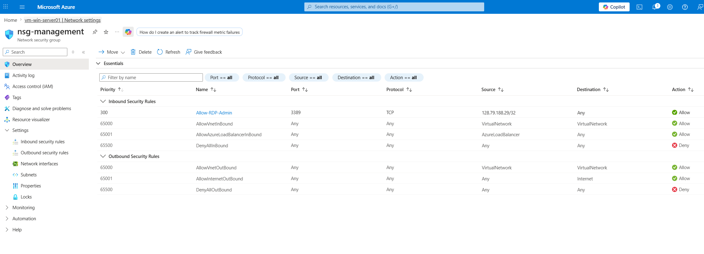

# Azure Enterprise Infrastructure Lab

## Project Overview

This project is a hands-on Azure infrastructure lab I built to practice core cloud administration skills.

The lab includes a virtual network, segmented subnets, Linux and Windows virtual machines, Network Security Groups, Azure Monitor alerting, and Azure Backup. The goal was to build something practical that shows how basic Azure infrastructure is deployed, secured, monitored, backed up, and documented.

This is not meant to be a full production enterprise design. It is a portfolio lab focused on the main skills used in Azure administrator, system administrator, and junior cloud engineer roles.

---

## Architecture Summary

The environment is built inside one Azure resource group and uses a single virtual network with separate subnets for different workload types.

### Network Design

| Component | Configuration |
|---|---|
| Resource Group | `rg-enterprise-lab` |
| Virtual Network | `vnet-enterprise-lab` |
| Address Space | `10.10.0.0/16` |
| Web Subnet | `subnet-web` - `10.10.1.0/24` |
| Server Subnet | `subnet-server` - `10.10.2.0/24` |
| Management Subnet | `subnet-management` - `10.10.3.0/24` |

### Virtual Machines

| VM Name | Operating System | Purpose | Subnet |
|---|---|---|---|
| `vm-linux-web01` | Ubuntu Linux 24.04 | Public Nginx web server | `subnet-web` |
| `vm-win-server01` | Windows Server 2025 | Management/server administration VM | `subnet-management` |

### Security Layout

| NSG | Purpose |
|---|---|
| `nsg-web` | Allows HTTP to the Linux web server and restricts SSH to an admin IP |
| `nsg-management` | Restricts RDP access to the Windows Server VM to an admin IP |
| `nsg-server` | Reserved for future internal server workload rules |

---

## Technologies Used

- Microsoft Azure
- Azure Virtual Network
- Azure Subnets
- Network Security Groups
- Ubuntu Linux 24.04
- Windows Server 2025
- Nginx
- Azure Monitor
- Log Analytics Workspace
- Azure Alerts
- Recovery Services Vault
- Azure Backup
- GitHub documentation

---

## What Was Built

This lab includes:

- A dedicated Azure resource group for the lab
- A virtual network with separate web, server, and management subnets
- Subnet-level Network Security Groups
- A Linux VM running Nginx as a public web server
- A Windows Server VM placed in the management subnet
- Restricted SSH and RDP access using admin IP rules
- Public HTTP access to the Linux web server
- Azure Monitor alerting for high CPU usage
- A Recovery Services Vault for VM backup
- Screenshot evidence for the main Azure components

---

## Project Evidence

### Resource Group

All lab resources were organized inside one Azure resource group.

---

### Virtual Network and Subnets

The virtual network was divided into separate subnets for web, server, and management workloads.

---

### Linux Web Server

The Linux VM was deployed into the web subnet and configured with Nginx.

The public Nginx page confirms the Linux VM, public IP, HTTP rule, and web server are working.

---

### Windows Server VM

The Windows Server VM was deployed into the management subnet.

---

### Network Security Groups

The web NSG allows HTTP traffic to the Linux web server and restricts SSH access to an admin IP.

The management NSG restricts RDP access to an admin IP.

The server NSG is reserved for future internal server workloads.

---

### Monitoring

Azure Monitor was configured with a high CPU alert rule.

---

### Backup

Azure Backup was configured using a Recovery Services Vault.

---

## Deployment Documentation

The deployment process is documented in the `deployment-steps` folder.

| File | Description |
|---|---|
| `01-resource-group.md` | Resource group setup |
| `02-virtual-network-subnets.md` | Virtual network and subnet design |
| `03-network-security-groups.md` | NSG rules and security configuration |
| `04-virtual-machines.md` | Linux and Windows VM deployment |
| `05-monitoring.md` | Azure Monitor and alerting |
| `06-backup.md` | Recovery Services Vault and VM backup |
| `07-cleanup.md` | Cleanup plan to avoid unnecessary Azure cost |

---

## Skills Practiced

This project helped me practice:

- Azure resource organization
- Virtual network planning
- Subnet segmentation
- Network Security Group configuration
- Linux VM deployment
- Windows Server deployment
- Nginx web server setup
- Public and private IP addressing
- Restricting admin access to trusted IPs
- Azure Monitor alert configuration
- Azure VM backup configuration
- Writing clear technical documentation

---

## Project Scope

This lab focuses on the core Azure administration work needed to build a small cloud environment.

The design is intentionally simple. I focused on getting the foundation right first networking, VM placement, security rules, monitoring, backup, and documentation.

More advanced features like Azure Bastion, load balancing, availability zones, private-only administration, and Infrastructure as Code are listed as future improvements.

---

## Future Improvements

Planned improvements are documented here:

[future-improvements.md](future-improvements.md)

---

## Lessons Learned

Key lessons from this project are documented here:

[lessons-learned.md](lessons-learned.md)
