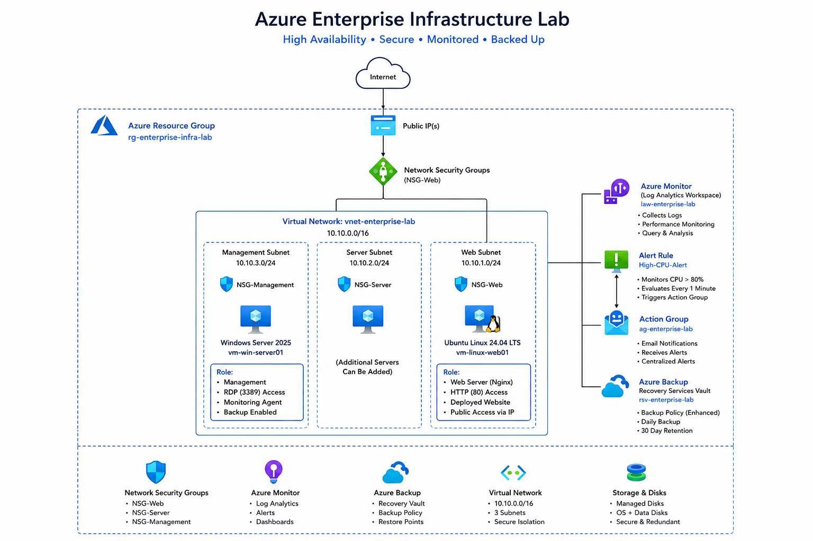
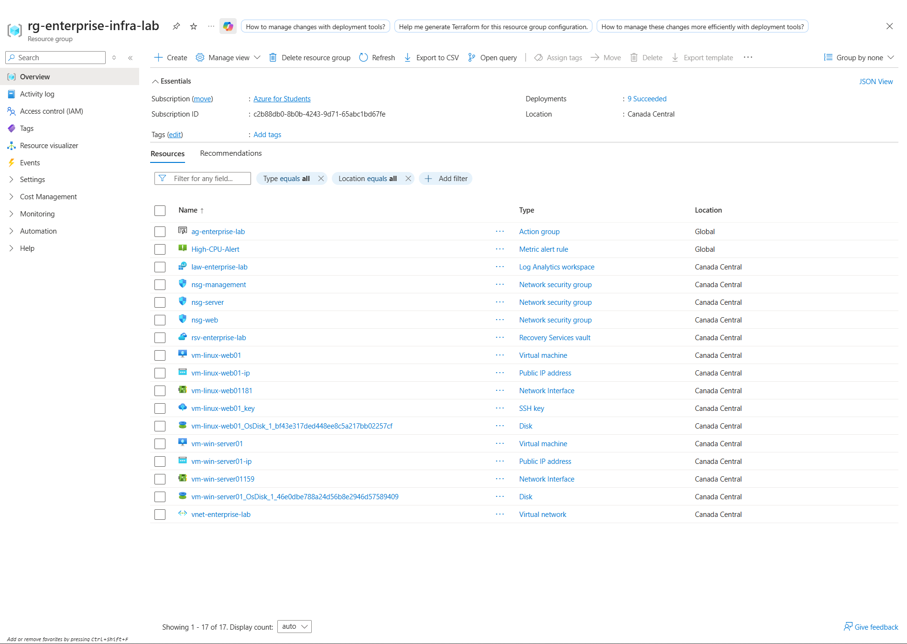
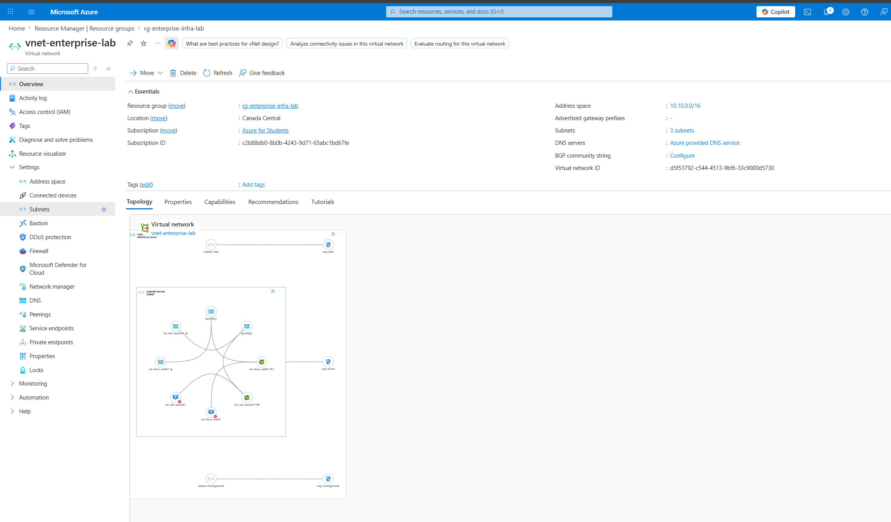
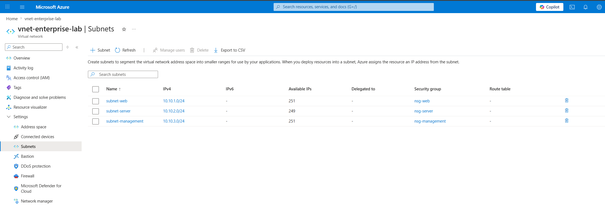
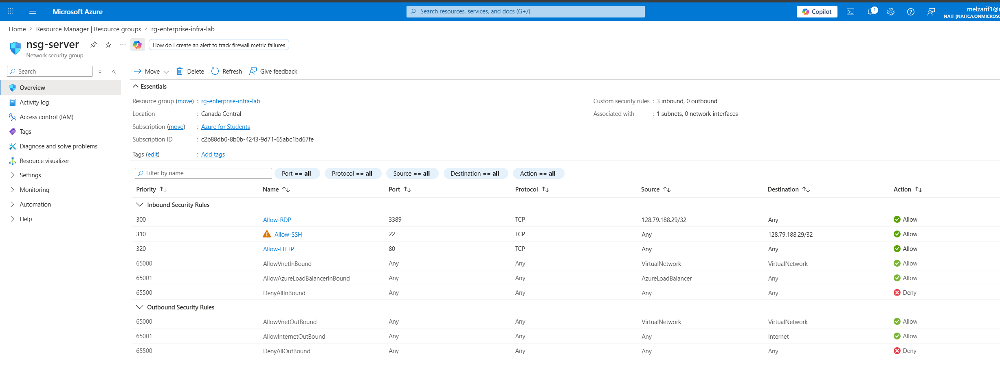
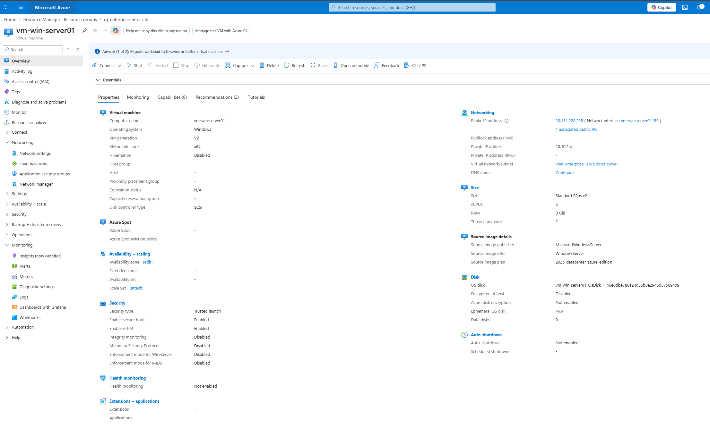
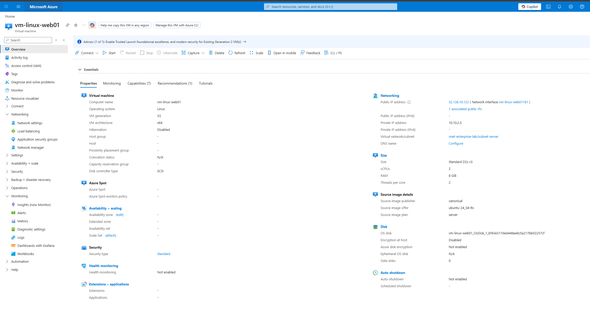
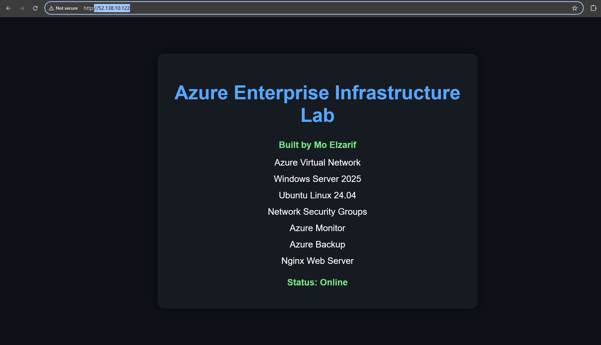
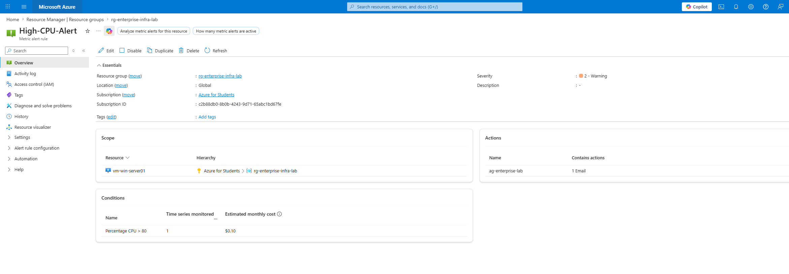
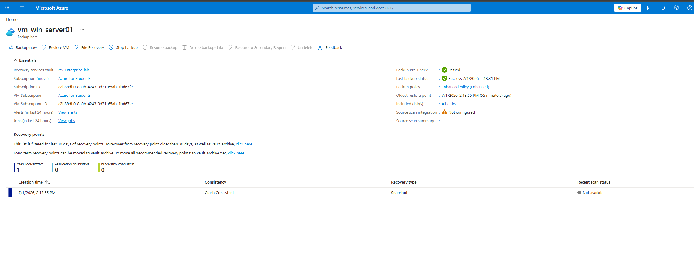

# Azure Enterprise Infrastructure Lab

Enterprise Azure infrastructure project demonstrating cloud administration, networking, Windows and Linux virtual machines, monitoring, backup, and network security.

---

# Project Overview

This lab simulates a small enterprise Azure environment.

## Infrastructure Built

- Azure Resource Group
- Azure Virtual Network
- Three Subnets
- Windows Server 2025 Virtual Machine
- Ubuntu Linux 24.04 Virtual Machine
- Network Security Groups
- Azure Monitor
- CPU Alert Rule
- Azure Backup
- NGINX Web Server

---

# Architecture

---

# Deployment Documentation

- Resource Group
- Virtual Network & Subnets
- Network Security Groups
- Virtual Machines
- Azure Monitor
- Azure Backup
- Cleanup

Detailed documentation is available inside the **deployment-steps** folder.

---

# Screenshots

## Resource Group

## Virtual Network

## Network Security Group

## Windows Server VM

## Ubuntu Linux VM

## NGINX Website

## Azure Monitor Alert

## Azure Backup

---

# Skills Demonstrated

- Azure Administration
- Azure Networking
- Windows Server Administration
- Linux Administration
- Network Security
- Azure Monitor
- Azure Backup
- Infrastructure Documentation
- Git & GitHub

---

# Technologies Used

- Microsoft Azure
- Windows Server 2025
- Ubuntu Server 24.04
- NGINX
- Azure Monitor
- Azure Backup
- Git
- GitHub